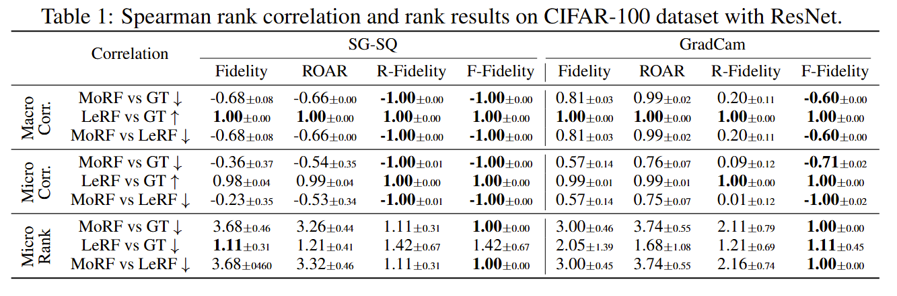
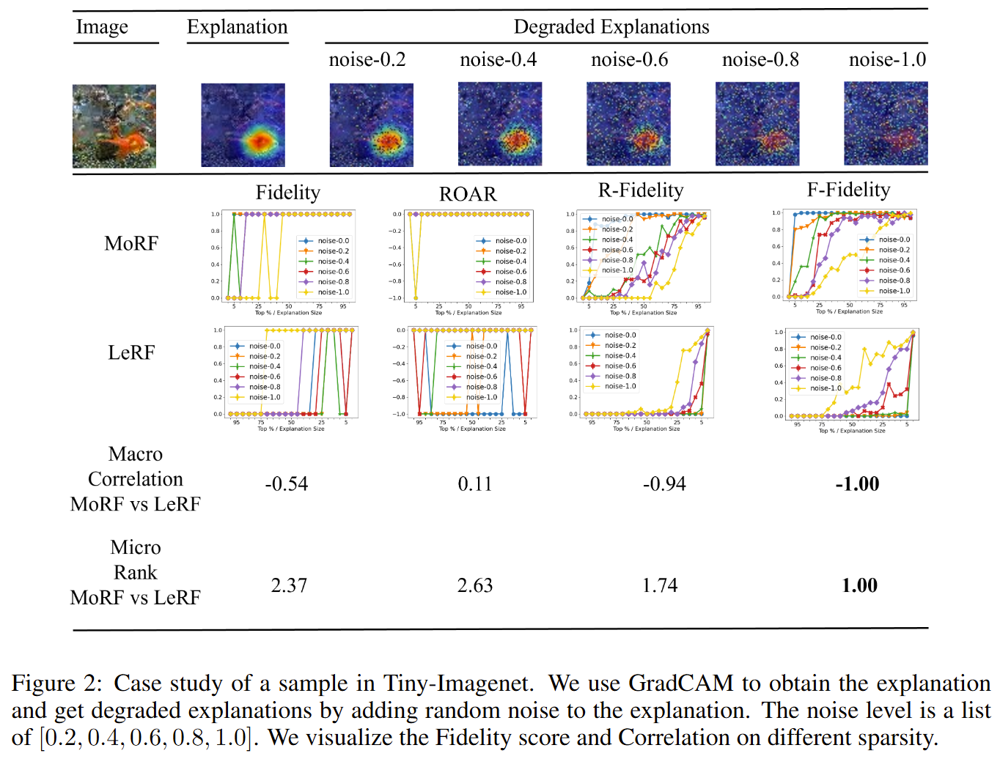

# This repo is for our ICLR2025 paper [F-Fidelity: A Robust Framework for Faithfulness Evaluation of Explainable AI](https://openreview.net/pdf?id=X0r4BN50Dv) [[project]](https://trustai4s-lab.github.io/ffidelity.html) 


# Update! We add a [sample](./tools/image_example.py)(easy to use) for image classifications. It is easy to adopt to other domain, such as Time Series.







## Use F-Fidelity as Metric
- If you just want to use our fidelity for evaluation, please refer to the [example](./tools/image_example.py) in the tools.


## Reproduce (We provide the code for cifar100 reproduction)
- Train and finetune the classification model. During finetuning, please use random deletion random augmenation with ratio $\beta$. We provide our [solution](./code/train_model.py) for these task. 
- Obtain initial explanations, we provide the [examples](./code/explain_model.py) of CAMs and IGs. Generate various noise degraded explanations. 
- [Evaluation](./code/evaluation_model.py)
- We also provide the results of cifar100 in [google drive](https://drive.google.com/file/d/176xRtn3ryGg0qwGUK1Se1cIsnn9dIEO3/view?usp=drive_link)


## Environments & Libraries
- numpy, PIL, python-opencv, matplotlib, tqdm
- pytorch, torchvision
- captum
- pytorch-grad-cam


```angular2html
@misc{zheng2024ffidelityrobustframeworkfaithfulness,
      title={F-Fidelity: A Robust Framework for Faithfulness Evaluation of Explainable AI}, 
      author={Xu Zheng and Farhad Shirani and Zhuomin Chen and Chaohao Lin and Wei Cheng and Wenbo Guo and Dongsheng Luo},
      year={2024},
      eprint={2410.02970},
      archivePrefix={arXiv},
      primaryClass={cs.LG},
      url={https://arxiv.org/abs/2410.02970}, 
}
```